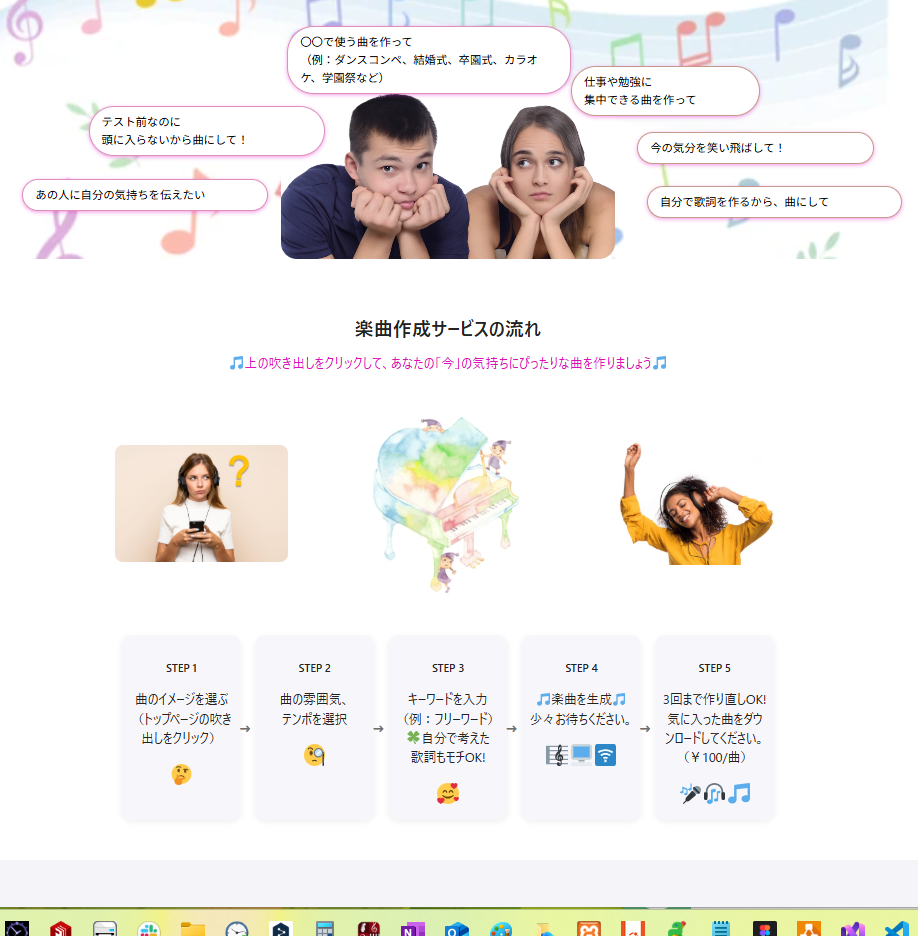
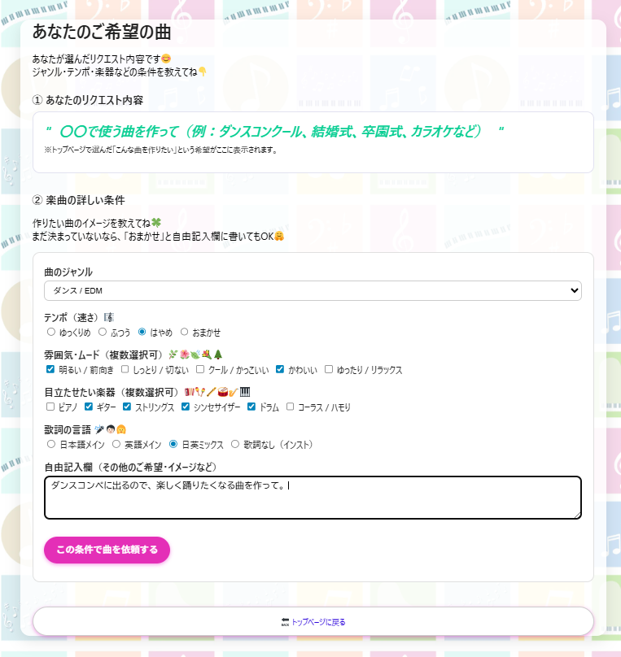
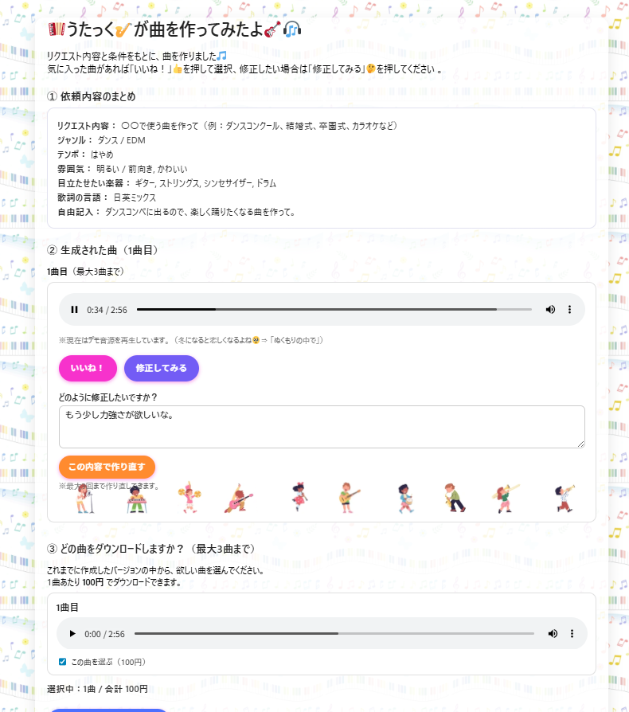

# AI Music Request（WordPressオリジナルテーマ）

## Screenshots

### Request Screen

### Input Example

### Result Screen

## 概要
WordPressのオリジナルテーマとして制作した、
AI楽曲リクエスト用のデモアプリです。

ユーザーの入力内容をもとに、
リクエスト内容を次の画面に引き継ぎ表示する
フォーム駆動型の構成になっています。

## 使用技術
- WordPress（オリジナルテーマ）
- PHP
- HTML / CSS
- JavaScript

## 実装ポイント
- header.php / footer.php を分離し、wp_head / wp_footer を使用
- wp_enqueue_style / wp_enqueue_script によるアセット管理
- オリジナルの固定ページテンプレートを作成
- GET / SESSION を用いたデータの受け渡し

## 設計意図
ブログ表示を主目的としたテーマではなく、
フォーム入力 → 結果表示という
アプリケーション的な要件を想定して設計しています。

WordPressをCMSとしてだけでなく、
軽量なWebアプリケーションの基盤として
活用することを意識しました。

## 補足
本作品は学習およびポートフォリオ用途のデモです。
外部AIサービスとの連携を想定した構成ですが、
実運用を目的としたものではありません。
